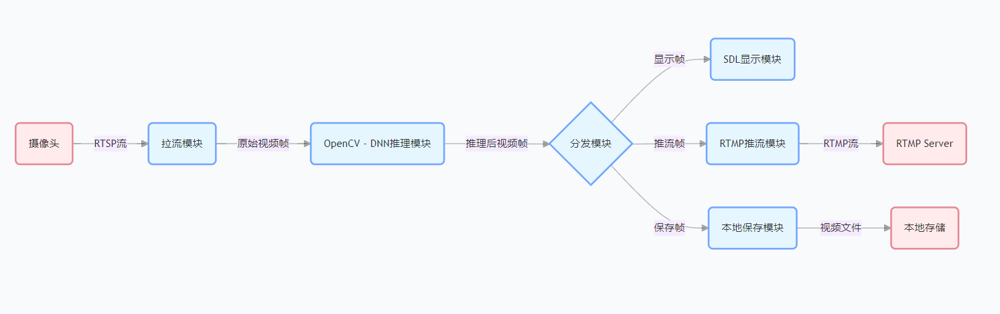
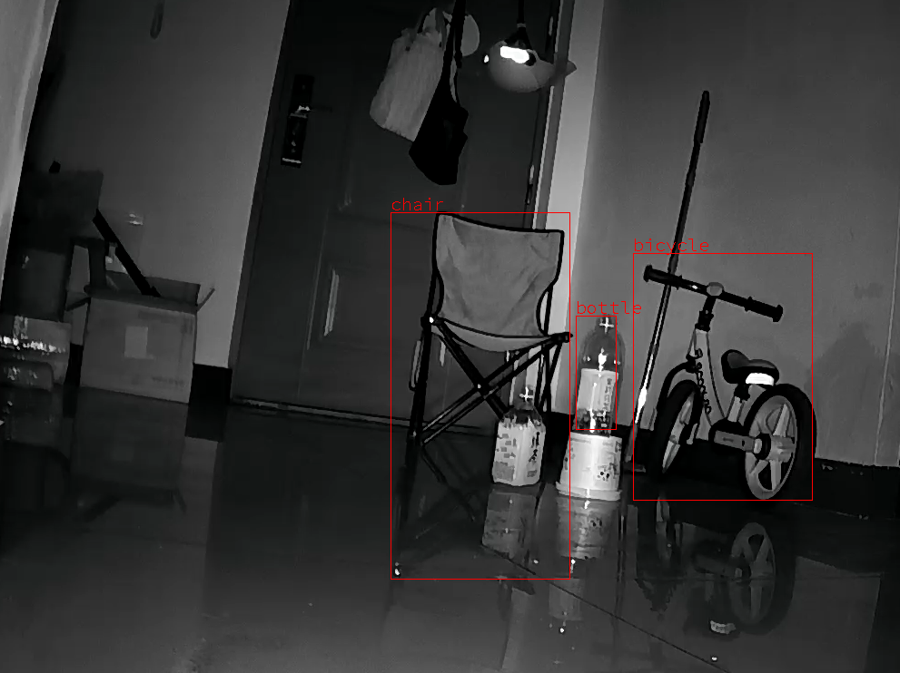

# 仓库介绍

拉取视频流并渲染到图形界面，同时对每一帧进行YOLOV8推理，最后融合到视频输出。

---

## 拓扑


## 效果


## 环境要求

- **开发语言**：C
- **依赖库**：
    - ffmpeg/7
    - sdl2/2.30.11
    - opencv/4.11.0
    - libcurl/7
- **系统环境**：支持 Linux、Windows 等平台

## 编译与运行

### 编译项目

确保系统已安装依赖库，并通过 `pkg-config` 正确配置库路径。执行以下命令编译项目：

```bash
make
```

### 清理文件

```bash
make clean
```

### 运行程序

编译成功后，运行以下命令启动程序：

### RTSP

```bash
./generic-stream-yolov8-render rtsp://192.168.10.3:554/av0_0 rtmp://192.168.10.5:1935/live/tlive001
```

### 摄像头
```sh
./generic-stream-yolov8-render "1080P USB Camera"  "rtmp://192.168.10.7:1935/live/tlive001"
```

### Docker 环境
```sh
docker run --rm -it -p 1935:1935 -p 1985:1985 -p 8080:8080 ossrs/srs:5
```

## YoloV8类型
```
  0 => person
  1 => bicycle
  2 => car
  3 => motorcycle
  4 => airplane
  5 => bus
  6 => train
  7 => truck
  8 => boat
  9 => traffic light
  10 => fire hydrant
  11 => stop sign
  12 => parking meter
  13 => bench
  14 => bird
  15 => cat
  16 => dog
  17 => horse
  18 => sheep
  19 => cow
  20 => elephant
  21 => bear
  22 => zebra
  23 => giraffe
  24 => backpack
  25 => umbrella
  26 => handbag
  27 => tie
  28 => suitcase
  29 => frisbee
  30 => skis
  31 => snowboard
  32 => sports ball
  33 => kite
  34 => baseball bat
  35 => baseball glove
  36 => skateboard
  37 => surfboard
  38 => tennis racket
  39 => bottle
  40 => wine glass
  41 => cup
  42 => fork
  43 => knife
  44 => spoon
  45 => bowl
  46 => banana
  47 => apple
  48 => sandwich
  49 => orange
  50 => broccoli
  51 => carrot
  52 => hot dog
  53 => pizza
  54 => donut
  55 => cake
  56 => chair
  57 => couch
  58 => potted plant
  59 => bed
  60 => dining table
  61 => toilet
  62 => tv
  63 => laptop
  64 => mouse
  65 => remote
  66 => keyboard
  67 => cell phone
  68 => microwave
  69 => oven
  70 => toaster
  71 => sink
  72 => refrigerator
  73 => book
  74 => clock
  75 => vase
  76 => scissors
  77 => teddy bear
  78 => hair drier
  79 => toothbrush
```